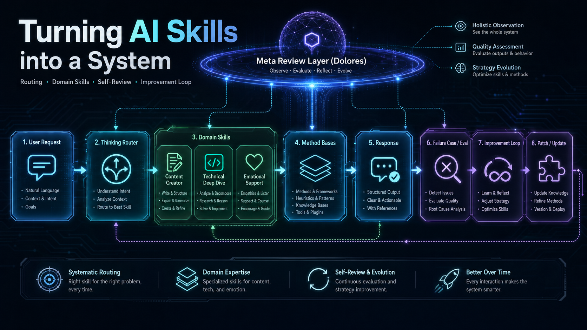

# Thinking Skills

Independent, domain-neutral AI thinking skills with routing, domain methods, conversation self-review, and an improvement loop.

English | [简体中文](./README.zh.md)



## What Is This?

Thinking Skills is a framework for helping AI agents choose the right mode of thought before answering.

Many agent skills are powerful, but they often inherit a hidden default: when a request is unclear, they treat it as a software development task. That works well for coding workflows, but it fails when the user is writing, making a life decision, exploring an emotional problem, shaping a creative idea, or asking for non-technical thinking support.

Thinking Skills separates:

```text
intent routing
-> domain-specific thinking
-> conversation self-review
-> failure cases and evals
-> improvement loop
```

The goal is not to build a larger prompt collection. The goal is to make AI skills more composable, inspectable, domain-neutral, and able to improve from real failures.

## Alpha Status

Thinking Skills is currently in Alpha.

The framework is usable, but it is still evolving through real conversations, failure cases, evals, and user feedback. I cannot cover every domain, platform, and personal workflow alone, so the project is designed to grow with contributors.

You can:

1. Install Thinking Skills locally.
2. Use it in your own writing, technical, emotional, creative, or decision-making workflows.
3. Evolve personal skills that fit your recurring contexts.
4. Keep private skills local when they are personal or sensitive.
5. Open a PR when a skill, eval, failure case, or platform adapter has general value.

The long-term goal is not one universal skill set controlled by one maintainer. It is a shared framework where people can grow their own thinking skills and contribute the parts that should become reusable.

## Why It Exists

The same phrase can require very different thinking modes:

```text
I have an idea. Help me think it through.
```

That could mean:

- Shape an article.
- Analyze a technical design.
- Understand an emotional pattern.
- Make a life decision.
- Explore a creative direction.

If the assistant defaults to coding, the conversation is already off course.

Thinking Skills starts with a router, then hands the request to the skill whose worldview, method base, output shape, and safety boundary fit the situation.

## Core Architecture

```text
User Request
  -> thinking-router
  -> routing/domain skill
  -> method bases
  -> response
  -> meta review layer / Dolores
  -> feedback or failure case
  -> eval
  -> minimal patch
```

| Layer | Responsibility |
|---|---|
| Router | Classify intent and choose the right thinking mode |
| Domain skills | Handle the actual task with domain-specific judgment and output shape |
| Method bases | Make the underlying methods explicit without dumping frameworks on the user |
| Meta skills | Review skill traces, mode shifts, failure signals, and eval gaps |
| Improvement loop | Turn real failures into abstract cases, evals, and small patches |
| Platform adapters | Expose the same canonical skills across agent runtimes |

## First-Party Skills

### Routing and Domain Skills

| Skill | Use When |
|---|---|
| `thinking-router` | A request needs to be routed to the right thinking mode |
| `content-creator` | Articles, essays, scripts, titles, outlines, arguments, audience positioning, and content structure |
| `technical-deep-dive` | Code, architecture, debugging, performance, APIs, systems, technical trade-offs, and verification paths |
| `emotional-support` | Anxiety, stress, self-blame, relationship pain, emotional confusion, crisis signals, and gentle next steps |

### Meta and Improvement Skills

| Skill | Use When |
|---|---|
| `conversation-review` | Dolores mode for conversation self-review, skill trace audits, failure signals, eval gaps, and improvement-loop actions |
| `skill-evaluator` | Review failed skill responses, classify failure types, propose evals, and recommend minimal patches |

Planned skills:

- `life-decision`
- `creative-studio`
- `learning-coach`
- `business-strategy`

## Dolores: The Meta Skill

`conversation-review`, also called Dolores mode, is not just another domain skill.

Domain skills produce answers. Dolores reviews how those answers were produced.

Dolores Mode is inspired by the awakening process in *Westworld*. In Thinking Skills, it means Conversation Self-Review & Improvement Loop: the AI can revisit its memories, meaning the available conversation context, inspect how it reasoned, and perform structural self-correction before finalizing or improving future output.

The name is used as a thematic reference only. Thinking Skills is not affiliated with *Westworld* or its rights holders.

It can inspect a prior conversation and ask:

- Which skills were triggered?
- Was the route correct?
- Did the right skill use the wrong submode?
- Was the output too long, too clinical, too technical, or too shallow?
- Did the assistant miss a safety boundary?
- Is there an eval gap?
- Should this become an abstract failure case?
- What is the smallest useful patch?

This is the main bridge between normal skill use and the improvement loop.

## Installation

### Install the skill with Skills CLI:

```bash
npx skills add huajiexiewenfeng/thinking-skills
```

For local development from the repository root:

```bash
npx skills add .
```

After installation, restart Codex or your agent runtime so the skills can be rediscovered.

### Platform Support

| Platform | Status |
|---|---|
| Codex native skills | Locally verified |
| Codex plugin | Implemented |
| Claude Code plugin | Implemented |
| Cursor plugin/rules | Implemented |
| OpenCode adapter | Implemented |

Important distinction:

- Codex **Skills** appear through native skill discovery.
- Codex **Plugins** appear only after plugin installation or marketplace flow.

See [Platform Support](docs/platforms.md) and [`.codex/INSTALL.md`](.codex/INSTALL.md).

## Usage Examples

Use it naturally:

```text
I have an idea and want to think it through.
```

```text
Help me write an article about AI companionship.
```

```text
I feel anxious and keep blaming myself.
```

```text
This API design feels wrong. Help me analyze the trade-offs.
```

```text
self-review
```

```text
Enter Dolores mode and review this conversation.
```

Or force a specific skill:

```text
Use thinking-router to choose the right thinking mode for this request.
```

```text
Use content-creator to help me find the angle and outline.
```

```text
Use emotional-support to help me sort out what I am feeling.
```

```text
Use conversation-review to audit the skill trace and improvement-loop opportunities in this conversation.
```

## How to Know It Is Working

Thinking Skills is working when:

- Non-technical requests are not forced into coding workflows.
- Writing tasks produce audience, angle, thesis, and structure instead of implementation plans.
- Technical tasks separate facts, assumptions, hypotheses, trade-offs, and verification.
- Emotional-support tasks validate feelings, avoid diagnosis, and prioritize safety when needed.
- Conversation-review tasks identify skill traces, failure signals, eval gaps, and small improvement patches.
- Ambiguous requests trigger one short routing question instead of a long intake form.

## Design Principles

- **Domain-neutral by default**: do not assume software development.
- **Router does not solve**: route first, then let the selected skill reason.
- **Skills own their worldview**: each domain has its own questions, outputs, and boundaries.
- **Methods beat vibes**: every domain skill declares method bases.
- **Methods stay mostly internal**: frameworks guide the response, but should not become visible machinery unless useful.
- **One question at a time**: clarify without overwhelming the user.
- **Failure becomes data**: reusable failures should become cases, evals, and minimal patches.
- **Safety boundaries matter**: high-stakes domains require careful escalation and scope limits.

## Project Structure

```text
skills/
  thinking-router/
  content-creator/
  technical-deep-dive/
  emotional-support/
  conversation-review/
  skill-evaluator/

docs/
  architecture-memory.md
  routing.md
  method-bases.md
  safety.md
  evaluation.md
  improvement-loop.md
  failure-taxonomy.md
  eval-schema.md
  eval-runbook.md
  platforms.md
  roadmap.md

evals/
  routing-cases.md
  content-creator-cases.md
  technical-deep-dive-cases.md
  emotional-support-cases.md
  conversation-review-cases.md
  skill-evaluator-cases.md

cases/
feedback/
```

## Documentation

- [Roadmap](docs/roadmap.md)
- [Architecture Memory](docs/architecture-memory.md) / [中文](docs/architecture-memory.zh.md)
- [Routing](docs/routing.md)
- [Method Bases](docs/method-bases.md)
- [Safety](docs/safety.md)
- [Evaluation](docs/evaluation.md)
- [Improvement Loop](docs/improvement-loop.md)
- [Failure Taxonomy](docs/failure-taxonomy.md)
- [Eval Schema](docs/eval-schema.md)
- [Eval Runbook](docs/eval-runbook.md)
- [Platform Support](docs/platforms.md)
- [Skill Authoring](docs/skill-authoring.md)
- [Contributing](CONTRIBUTING.md)

## Relationship to Superpowers

Thinking Skills is independent from Superpowers.

It borrows useful ideas from skill-based workflows, but does not depend on Superpowers, its runtime, naming, or coding-first conventions.

## License

MIT
