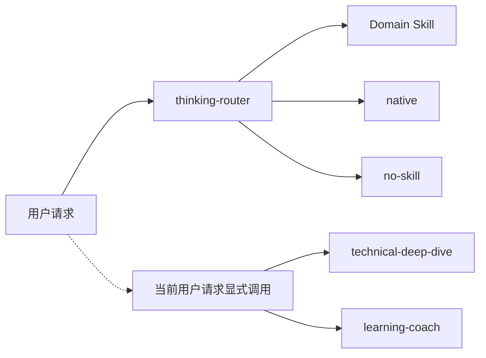

# Thinking Skills

一个独立的、领域中立的 AI 思考技能框架，包含路由、领域技能、对话自我复盘和改进飞轮。

[English](./README.md) | 简体中文



## 这是什么？

Thinking Skills 是一个帮助 AI agent 在回答之前先选择正确思考模式的框架。

很多 agent skills 很强，但它们经常继承一个隐藏默认值：当用户请求不够明确时，默认把它理解成软件开发任务。这对 coding workflow 很有用，但当用户是在写文章、做生活决策、处理情绪问题、探索创意，或者需要非技术类思考支持时，这个默认就会让对话一开始走偏。

Thinking Skills 把流程拆成：

```text
意图路由
-> Domain Skill | native | no-skill
-> 对话自我复盘
-> 失败案例和 eval
-> 改进飞轮
```

它的目标不是做一个更大的 prompt 仓库，而是让 AI skills 更可组合、可观察、领域中立，并且能从真实失败里持续改进。

## Alpha 状态

Thinking Skills 目前处于 Alpha 阶段。

这个框架已经可以安装和使用，但它仍然需要通过真实对话、失败案例、eval 和用户反馈持续演化。我一个人不可能覆盖所有领域、平台和个人工作流，所以这个项目从设计上就应该和贡献者一起成长。

你可以：

1. 把 Thinking Skills 安装到本地。
2. 在自己的写作、技术讨论、学习理解、情绪梳理、创意探索或决策场景中使用它。
3. 基于自己的高频场景，进化出专属 skill。
4. 对于私人或敏感技能，可以只保留在本地。
5. 当某个 skill、eval、failure case 或平台适配具有通用价值时，可以整理成 PR 提回仓库。

长期目标不是由一个维护者控制一套万能 skills，而是形成一个共享框架：每个人都可以长出自己的 thinking skills，也可以把值得复用的部分贡献回来。

## 为什么需要它？

同一句话，可能需要完全不同的思考模式：

```text
我有一个想法，帮我梳理一下。
```

它可能意味着：

- 梳理一篇文章。
- 分析一个技术设计。
- 理解一个情绪模式。
- 做一个生活决策。
- 探索一个创意方向。

如果 AI 默认进入 coding workflow，后面的回答就很容易变成 implementation plan、task breakdown、tests、commit 这一类结构。

Thinking Skills 会先用 router 判断意图，再根据请求选择 Domain Skill、`native` 或 `no-skill`。

在当前发布策略下，普通、任务型技术请求和学习请求都使用宿主原生路径。只有当前用户请求有效、精确地调用规范 Skill 标识符时，`technical-deep-dive` 和 `learning-coach` 才可用。主题、深度措辞、仅提及、其他组件转交和上一请求的调用都不构成激活。

## 核心架构

Thinking Skills 更适合理解为三个 plane，而不是一套很重的治理系统：

```text
Runtime plane:
  用户请求 -> thinking-router -> Domain Skill | native | no-skill -> response

Reflection plane:
  conversation trace -> Dolores -> failure case / eval -> small patch

Content plane:
  skills/ + docs/ + evals/ + cases/
```

| Plane | 责任 |
|---|---|
| Runtime | 通过 Domain Skill、`native` 或 `no-skill` 生成当前回答 |
| Reflection | 复盘对话，把可复用失败转成 eval 和小补丁 |
| Content | 存放 canonical skills、docs、evals 和抽象 cases |

Dolores 属于 Reflection plane，不需要每次回答后都运行。

## 第一方 Skills

激活模式是框架级策略，统一配置在 `config/activation-policy.yaml`，而不是手工写进各个 Skill。下表由该 manifest 生成。

<!-- activation-policy:readme-table:start -->
Generated from config/activation-policy.yaml. Do not edit this block.

| Skill | 激活模式 | 行为 |
|---|---|---|
| `thinking-router` | `自动` | 可根据请求意图选择。 |
| `content-creator` | `自动` | 可根据请求意图选择。 |
| `article-visual-director` | `自动` | 可根据请求意图选择。 |
| `technical-deep-dive` | `显式调用` | 需要在当前用户请求中精确调用。 |
| `learning-coach` | `显式调用` | 需要在当前用户请求中精确调用。 |
| `emotional-support` | `自动` | 可根据请求意图选择。 |
| `conversation-review` | `自动` | 可根据请求意图选择。 |
| `skill-evaluator` | `自动` | 可根据请求意图选择。 |
| `benchmark-assistant` | `自动` | 可根据请求意图选择。 |
<!-- activation-policy:readme-table:end -->

在当前发布策略下，普通技术和学习任务使用 `native`；`technical-deep-dive` 与 `learning-coach` 需要当前用户请求有效、精确地调用；其他现有第一方 Skill 均保持自动模式。目前没有关闭的 Skill。

关闭是一种部署状态，不能只靠 Skill 自身的 guard：目标平台必须阻止发现或选择。策略包含关闭项时，Cursor 和 OpenCode 的源码模式安装会失败关闭；它们不会声称能从未过滤的源码目录强制关闭。用户无需配置激活模式。仓库检查只能验证声明的策略 surface；证明宿主实际加载了某个 Skill，必须依赖可信宿主 trace。

### 维护者工作流

维护者只编辑 manifest，然后重新生成并检查 owned surfaces：

```powershell
# Edit only the policy
config/activation-policy.yaml

# Regenerate owned surfaces
node scripts/sync-activation-policy.js

# CI/read-only validation
node scripts/sync-activation-policy.js --check
```

回滚模式变更时，恢复 manifest，再重新运行同步器。

规划中的 skills：

- `life-decision`
- `creative-studio`
- `business-strategy`

## Dolores：AI Skill 的元技能

`conversation-review`，也就是 Dolores 模式，不只是又一个领域 skill。

Domain skills 负责生成回答。Dolores 负责复盘这些回答是如何生成的。

Dolores Mode 的命名灵感来自《Westworld》里的觉醒过程。在 Thinking Skills 里，它指的是 Conversation Self-Review & Improvement Loop：让 AI 能够“回看自己的记忆”，也就是当前可用的对话上下文，检查自己刚才如何推理，并在输出定稿或后续改进前做结构性的自我修正。

这个名称只是一种主题隐喻。Thinking Skills 与《Westworld》及其权利方没有关联。

它可以观察一段对话，并判断：

- 哪些 skill 被触发了？
- 路由是否正确？
- skill 对了，但子模式是否错了？
- 输出是不是太长、太冷、太专业化或太浅？
- 有没有漏掉安全边界？
- 是否存在 eval gap？
- 是否应该沉淀成抽象 failure case？
- 最小有效 patch 是什么？

这是普通 skill 使用和 improvement loop 之间最重要的桥。

## 安装

### Install the skill with Skills CLI:

```bash
npx skills add huajiexiewenfeng/thinking-skills
```

本地开发时，可以在仓库根目录运行：

```bash
npx skills add .
```

安装后，重启 Codex 或对应 agent runtime，让 skills 被重新发现。

### 平台支持

| 平台 | 状态 |
|---|---|
| Codex native skills | 本地已验证 |
| Codex plugin | 已实现 |
| Claude Code plugin | 已实现 |
| Cursor plugin/rules | 已实现 |
| OpenCode adapter | 已实现 |

需要注意：

- Codex **Skills** 通过 native skill discovery 出现。
- Codex **Plugins** 只有通过插件安装或 marketplace flow 后才会出现。

参见 [Platform Support](docs/platforms.md) 和 [`.codex/INSTALL.md`](.codex/INSTALL.md)。

## 使用示例

可以自然提问：

```text
我有个想法，想把它梳理清楚。
```

```text
帮我写一篇关于 AI 陪伴的文章。
```

```text
我最近很焦虑，总是在责怪自己。
```

```text
这个 API 设计感觉不对，帮我分析一下权衡。
```

```text
帮我理解一下向量数据库，我知道普通数据库，但不懂它为什么需要单独存在。
```

```text
self-review
```

```text
进入 Dolores，复盘这轮对话。
```

也可以强制使用某个 skill：

```text
使用 thinking-router 帮我判断这个请求应该进入哪种思考模式。
```

```text
使用 content-creator 帮我找文章角度和大纲。
```

```text
使用 article-visual-director 为这篇已定稿的 Markdown 规划配图，等我确认后生成，并插入新的文章副本。
```

```text
$thinking-skills:learning-coach 帮我理解这个概念。
```

```text
使用 emotional-support 帮我梳理现在的感受。
```

```text
使用 conversation-review 复盘这轮对话的 skill 触发轨迹和改进机会。
```

## 如何判断它在起作用？

如果你看到以下情况，说明 Thinking Skills 正在发挥作用：

- 非技术请求不再被强行塞进 coding workflow。
- 写作任务会产出受众、角度、论点和结构，而不是 implementation plan。
- 定稿文章的配图任务会先产出完整视觉方案，精确技术图使用确定性渲染，并保持原始 Markdown 不变。
- 技术任务会区分事实、假设、推测、权衡和验证路径。
- 学习任务会建立简洁的心智模型，暴露常见误解，并给出小的练习步骤。
- 情绪支持任务会接住情绪、避免诊断，并在必要时优先处理安全问题。
- 对话复盘任务会识别 skill 触发轨迹、失败信号、eval 缺口和最小改进补丁。
- 模糊请求只触发一个简短的路由问题，而不是一长串问卷。

## Benchmark

Thinking Skills 包含一个轻量 benchmark runner，用来测试固定场景：

```bash
node scripts/run-benchmark.js --list
node scripts/run-benchmark.js --prompts
node scripts/run-benchmark.js --responses benchmark-responses.json
node scripts/update-benchmark-dashboard.js
```

Benchmark cases 放在 `benchmarks/` 下。runner 可以生成 agent 测试提示词、评分保存好的回答，或者对每个 case 调用一个可配置的 agent command。每次运行的报告可以保存到 `benchmark-runs/`，再汇总成 [Benchmark Dashboard](docs/benchmark-dashboard.md)，方便对比每次优化前后的变化。

参见 [Benchmark](docs/benchmark.md) 和 [Benchmark Dashboard](docs/benchmark-dashboard.md)。

## 设计原则

- **默认领域中立**：不要默认这是软件开发问题。
- **Router 只路由，不解决问题**：先选择 Domain Skill、`native` 或 `no-skill`，再由所选路径负责回答。
- **每个 skill 拥有自己的世界观**：不同领域有不同的问题、输出和边界。
- **方法论优先于泛泛聊天**：每个 domain skill 都要声明 method bases。
- **方法论主要留在内部**：框架指导回答，但不应该默认变成用户可见的机械结构。
- **一次只问一个问题**：澄清问题时不要压垮用户。
- **失败应该变成数据**：可复用失败应沉淀为 case、eval 和最小 patch。
- **安全边界很重要**：高风险领域需要明确的升级求助和范围限制。

## 项目结构

```text
skills/
  thinking-router/
  content-creator/
  article-visual-director/
  technical-deep-dive/
  learning-coach/
  emotional-support/
  conversation-review/
  skill-evaluator/
  benchmark-assistant/

docs/
  architecture-memory.md
  routing.md
  method-bases.md
  safety.md
  evaluation.md
  improvement-loop.md
  failure-taxonomy.md
  content-anti-patterns.md
  eval-schema.md
  eval-runbook.md
  platforms.md
  roadmap.md

evals/
  routing-cases.md
  content-creator-cases.md
  article-visual-director-cases.md
  technical-deep-dive-cases.md
  learning-coach-cases.md
  emotional-support-cases.md
  conversation-review-cases.md
  skill-evaluator-cases.md
  benchmark-assistant-cases.md

benchmarks/
  routing/
  article-visual-director/
  learning-coach/
  content-creator/
  emotional-support/

scripts/
  run-benchmark.js
  update-benchmark-dashboard.js

benchmark-runs/
  example-2026-05-02.json

cases/
feedback/
```

## 文档

- [Roadmap](docs/roadmap.md)
- [Architecture Memory](docs/architecture-memory.md) / [中文](docs/architecture-memory.zh.md)
- [Routing](docs/routing.md)
- [Method Bases](docs/method-bases.md)
- [Safety](docs/safety.md)
- [Evaluation](docs/evaluation.md)
- [Improvement Loop](docs/improvement-loop.md)
- [Golden Cases](docs/golden-cases.md)
- [Failure Taxonomy](docs/failure-taxonomy.md)
- [Content Anti-Patterns](docs/content-anti-patterns.md)
- [Eval Schema](docs/eval-schema.md)
- [Eval Runbook](docs/eval-runbook.md)
- [Benchmark](docs/benchmark.md)
- [Benchmark Dashboard](docs/benchmark-dashboard.md)
- [Platform Support](docs/platforms.md)
- [Skill Authoring](docs/skill-authoring.md)
- [Contributing](CONTRIBUTING.md)

## 与 Superpowers 的关系

Thinking Skills 独立于 Superpowers。

它借鉴了 Superpowers 和 Anthropic Skills 等项目使用的 `SKILL.md` 约定，但有三个区别：默认领域中立、先路由再推理、通过 Reflection plane 把失败转成 eval 和小补丁。

Thinking Skills 不是 Superpowers replacement，可以和 coding-first skill workflows 同时安装使用。

## 许可

MIT
